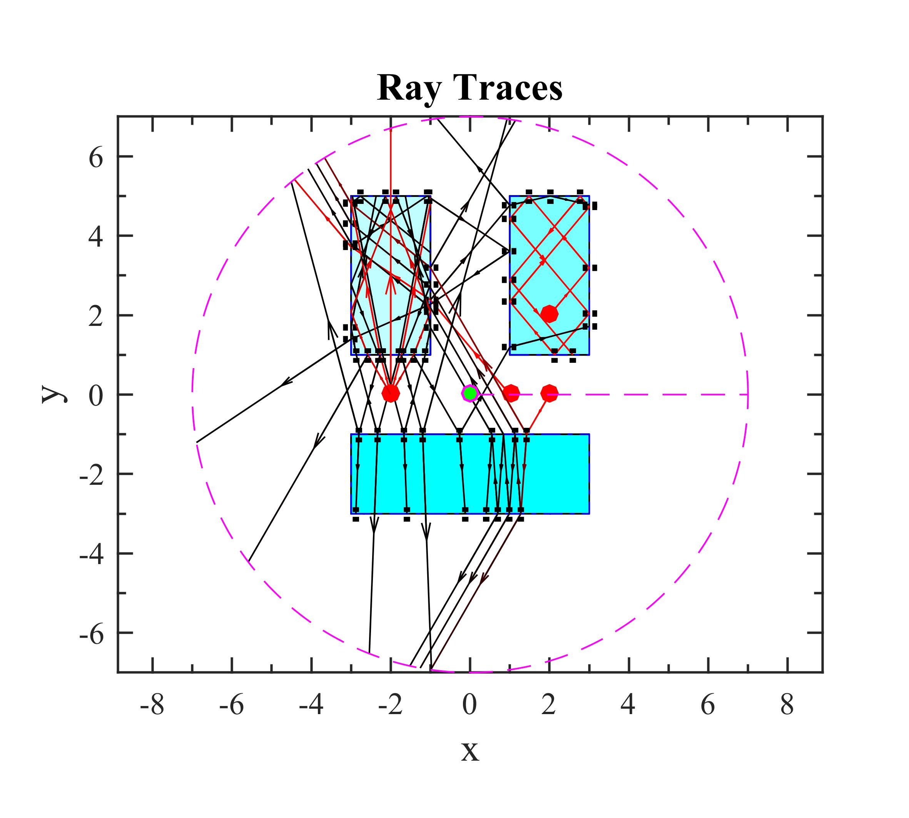
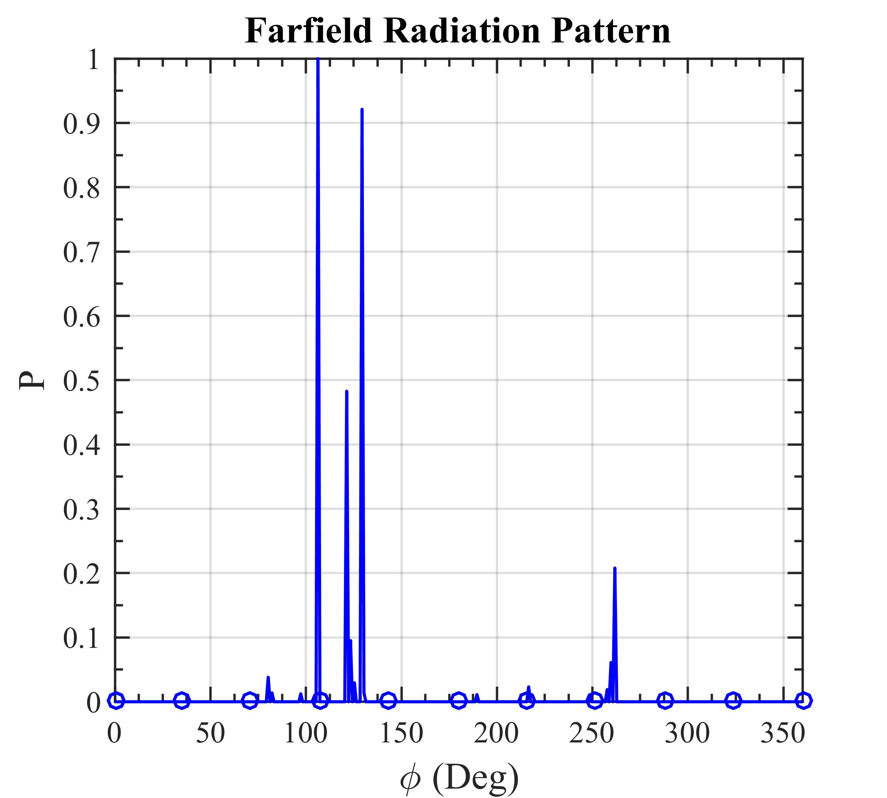

# OpticalRayTracer
A simple optical ray tracing simulation based on Snell's law and Fresnel equations for MATLAB and OCTAVE.

- Open **RayTracer.m** file in either **MATLAB** or **OCTAVE**.
- Change the geomtry of the optics and corresponding refractive indices based on the need.
- Define any number of sources you need with specific location, propagation direction and optical power.
- Define farfield radius, resolution, etc for farfield radiation pattern estimation.
- Set the ray tracing parameters including the maximum number of bouncing rays, minimum tracable power ray, etc.
- Run the code and get the ray tracing plot as well as farfield radiation pattern.

## Ray Tracing Results

## Farfield Radiation Pattern

